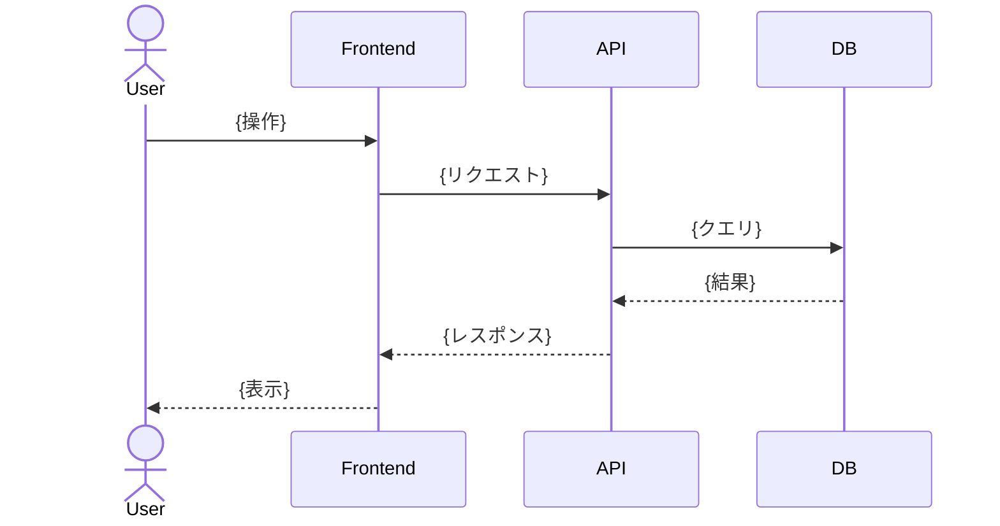

# Artifact: Design Doc

技術設計を記録・共有するためのドキュメントテンプレート。
「どう作るか」をまとめ、エンジニア間のアーキテクチャ合意に使う。

**作成の判断基準**: スコープが大きい・不確実性が高い・複数人が関わる実装が対象。
小規模で明確な実装は Design Doc を書かずに進めた方が速い。

## テンプレート

```markdown
# {機能名} Design Doc

- **作成者**: {名前}
- **レビュワー**: {名前}, {名前}
- **最終更新**: YYYY-MM-DD
- **ステータス**: Draft | In Review | Approved | Superseded

## 背景

{なぜこの開発が必要か。ビジネス上の課題・技術的な負債・既存の制約を記述する。}

## 目的

### Goals

- {技術的に達成すること1}
- {技術的に達成すること2}

### Non Goals

- {このDesignDocのスコープに含めないこと（密接に関連しているものを明示する）}

## 設計

### アーキテクチャ概要

{アーキテクチャ図・シーケンス図・データフロー図など。
図で表現できる場合は Mermaid や画像リンクを使う。}

### データモデル

{必要なテーブル・スキーマ変更を記述する。不要な場合は削除。}

| 論理名 | 物理名 | データ型 | Null | 備考 |
|--------|--------|---------|------|------|
|        |        |         |      |      |

### インターフェース

{HTTP エンドポイント・バッチ処理・イベントなどのインターフェース定義。不要な場合は削除。}

### UI設計

{画面構成・コンポーネント設計の方針。フロントエンドを伴わない場合は削除。}

- **画面構成**: {対象画面の一覧と目的}
- **コンポーネント構成**: {ディレクトリ・コンポーネントの設計方針}
- **UI ステート**: {ローディング / データなし / エラーなどの状態設計}
- **Figma**: {URL}

### ユースケース

{実現するユースケースを列挙する。ユーザーの操作ごとに行を分ける。}

| ユーザー | カテゴリ | ユースケース |
|--------|--------|-----------|
| {管理者など} | {機能名} | {操作内容} |

### シーケンス

{ユースケースごとの処理の流れを記述する。複雑な非同期処理・外部サービス連携がある場合に特に有効。}



## テスト方針

{単体テスト・結合テスト・E2Eテスト・負荷テストのうち、何をどの粒度で書くかの方針。}

## リリース計画

{段階リリース・フィーチャーフラグ・データマイグレーションの手順など。
リリース手順が自明な場合は削除。}

## モニタリング・ロギング

{アラートのしきい値・ログ出力方針。不要な場合は削除。}

## 懸念事項・未解決の問題

{現時点で不確実性が高い事項・決まっていない事項を列挙する。}

- [ ] {懸念事項1}
- [ ] {懸念事項2}
```

## 書き方のガイドライン

### どのセクションを書くか

Design Doc のサイズはスコープに応じて調整する。
**必須**: 背景 / 目的 / 設計
**任意**: それ以外（実装に応じて不要なセクションは削除してよい）

### 目的（Goals / Non Goals）の書き方

- ユーザーストーリーではなく、**技術的な達成事項**を書く
- Non Goals は「やらない」ではなく「このDocのスコープに含めない」事項を書く
- Goals と密接に関連するもの・混同されやすいものを Non Goals に記載する

### 懸念事項の活用

Draft 段階では不確実な事項をすべて列挙し、レビューを通じて1つずつ解消していく。
Approved 時点で全項目にチェックが入っている状態を目指す。

## ファイル命名規則

```
{機能名またはslug}/design-doc.md
```

例:
```
docs/features/candidate-list/design-doc.md
docs/features/multi-plan/design-doc.md
```
